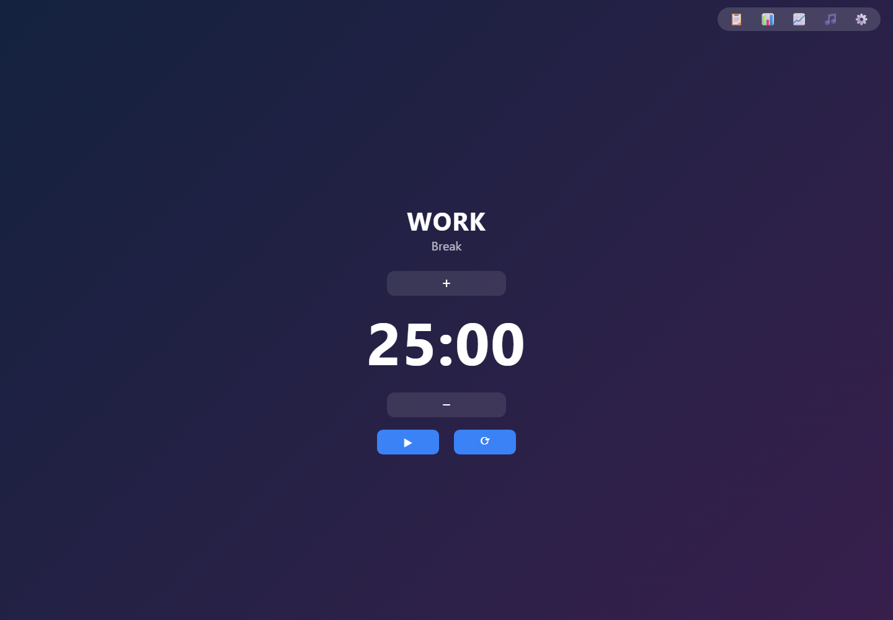
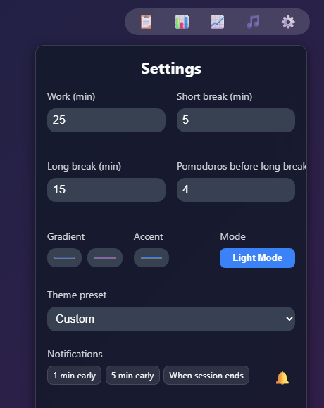
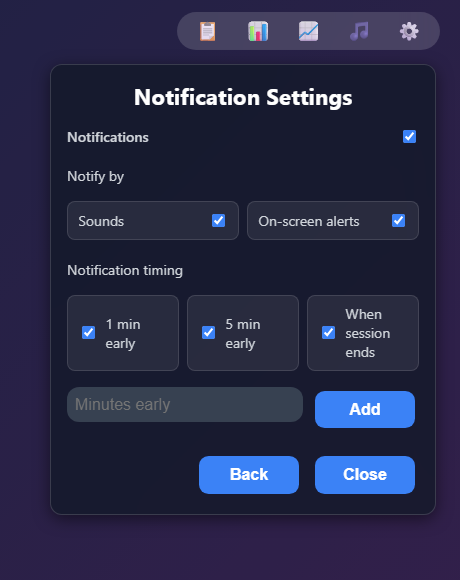
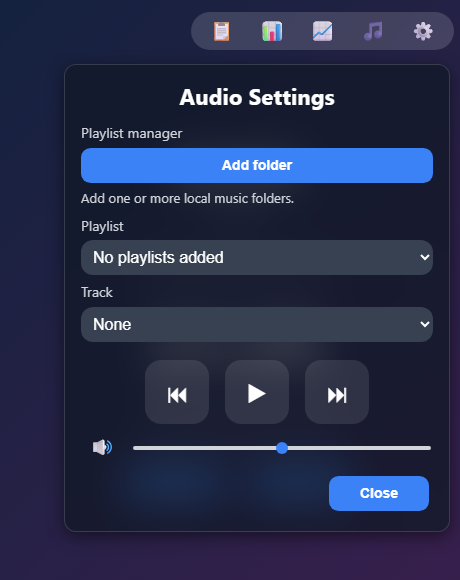
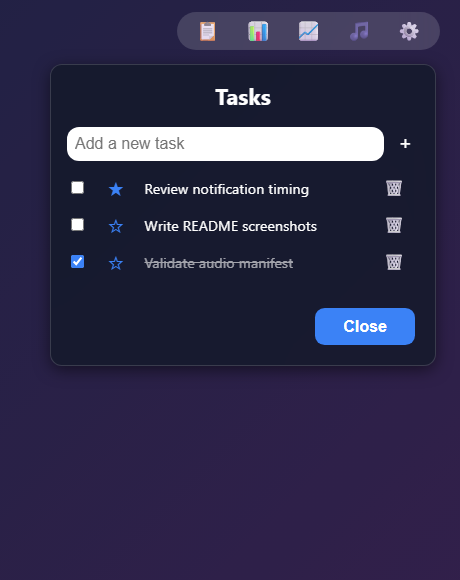
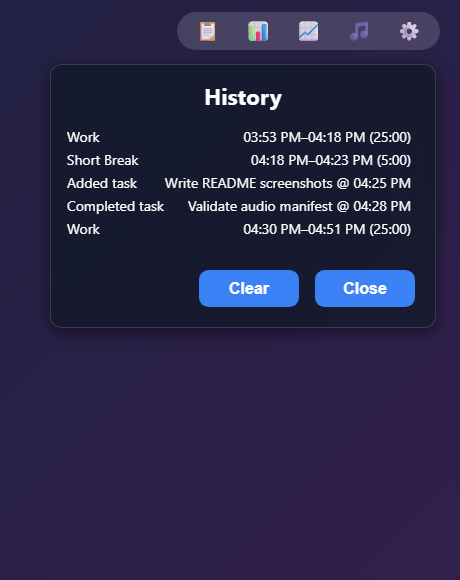
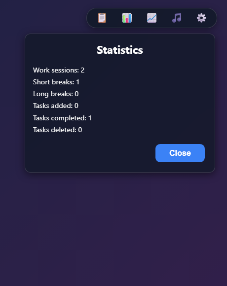

<h1>
  
  <samp>Pomodoro App</samp>
</h1>

`pomodoro-app` is a serverless, local-first Pomodoro timer and task manager for focused work sessions, breaks, ambient audio, lightweight history, and personal workflow tracking.

It is designed as one clean webpage: no backend, no account system, no sync requirement. User preferences, tasks, history, notification settings, and audio choices stay in the browser. JSON app state uses `localStorage`; local music folder access uses the browser picker and, where supported, an IndexedDB-stored folder handle.

## Current phase

The repo is in **static app polish** mode:
- **Focus pillar**: timer, session switching, break handling, notifications, and keyboard shortcuts.
- **Planning pillar**: local task list, starred tasks, session/task history, and simple stats.
- **Atmosphere pillar**: theme controls, gradients, audio playlists, and notification sounds.
- **Safety pillar**: local-only state, explicit browser permissions, safe DOM rendering, and no server dependency.

The default direction is serverless and device-local. Remote sync, accounts, or destructive data operations are not part of the current app model.

## Repository layout

```text
pomodoro-app/
  index.html                 # single-page app shell and slide-out panels
  app.js                     # timer, tasks, settings, history, audio, notifications
  style.css                  # responsive UI, panels, controls, themes
  update_songs.py            # optional local helper for generating ignored manifests
  process_video.py           # local helper for preparing loopable media
  assets/
    pomodoro-app-logo.png    # README/app logo
    audio/notify.mp3         # notification chime
    demo/                    # optional screenshots/GIFs for README demos
    music/                   # ignored local music scratch space
```

## Demo



| Settings | Notification settings | Audio settings |
| --- | --- | --- |
|  |  |  |

| Tasks | History | Statistics |
| --- | --- | --- |
|  |  |  |

## What is usable today

### 1. Pomodoro timer

Configurable work duration, short break, long break, and long-break cadence.

Controls include:
- Start / pause
- Reset
- Add or subtract one minute
- Postpone break once per break
- Manual work/break switching

### 2. Task manager

Tasks live in a slide-out panel and are stored locally. You can add, complete, star, delete, and reorder tasks. The app advances the current task after completed work sessions.

### 3. History and statistics

The app records session history and task events locally. The History panel shows the timeline, and the Statistics panel summarizes work sessions, breaks, and task activity.

History rendering uses DOM nodes and `textContent`; user-entered task text is not injected as HTML.

### 4. Local playlist manager

The Audio panel is a local playlist manager. Users add one or more music folders, choose a playlist, choose a track, and use play/pause, previous/next, mute, volume, and progress scrubbing.

Folder behavior:
- Each selected folder becomes manageable from the Audio panel.
- If a selected folder contains subfolders, each first-level subfolder becomes a playlist under that folder.
- Chromium browsers can remember folder handles through IndexedDB and reconnect them on later visits.
- Other browsers can use the file picker fallback for the current session.

The app does not ship or require music on GitHub Pages. It does not copy MP3s into `localStorage` and does not upload local audio anywhere.

### 5. Notification settings

Notification controls live in a focused Notification Settings panel opened from the main Settings panel.

Available knobs:
- **Notifications**: master switch for all notification output.
- **Sounds**: chime playback.
- **On-screen alerts**: toast and browser notification output.
- **Notification timing**: `1 min early`, `5 min early`, custom early reminders, and `When session ends`.

Browser notification permission is only useful for on-screen browser notifications. The app still works with local toast/chime behavior when browser permission is not granted.

### 6. Themes and visual settings

The app supports gradient background colors, accent color, theme presets, and dark/light mode. Panels use a compact slide-out pattern to avoid crowding the main timer.

## Running locally

No build step is required.

Open `index.html` in a browser, or serve the folder with any static file server if your browser blocks local media behavior from `file://`.

Example:

```bash
python -m http.server 8000
```

Then open:

```text
http://localhost:8000
```

## Local music workflow

Use the Audio panel to add music folders from the browser. On GitHub Pages, the expected flow is:

1. Open the app.
2. Open Audio Settings.
3. Click **Add folder**.
4. Choose a local music folder.
5. Select the generated playlist and track.

`audioManifest.js` and `assets/music/` are ignored local scratch paths. They are not part of the deployed app model.

## Local data model

The app stores normal app state as JSON in `localStorage`:
- timer preferences
- theme preferences
- notification preferences
- selected audio genre/track
- tasks
- session/task history
- quote of the day

Local music folder access uses browser APIs instead of storing audio files:
- Chromium: `showDirectoryPicker()` can grant access to multiple folders, and selected folder handles are stored in IndexedDB for reconnect/restore.
- Fallback: `<input type="file" webkitdirectory>` loads selected audio files for the current browser session.
- Runtime playback uses object URLs, which are revoked when a folder is deleted, replaced, or cleared.

Clearing browser site data clears app state and any remembered local folder handle. It does not delete user music files.

## Keyboard shortcuts

| Key | Action |
| --- | --- |
| `Space` | Start / pause timer |
| `R` | Reset timer |
| `P` | Postpone break |
| `+` / `-` | Add / subtract one minute |
| `B` or `W` | Toggle work/break mode |
| `M` | Mute/unmute audio |
| `V` | Play/pause audio |
| `T` | Open/close Tasks |
| `H` | Open/close History |
| `S` | Open/close Settings |
| `Escape` | Close open panel |

## Safety and design principles

- Static site by default.
- No backend required.
- Local browser state by default.
- Explicit browser permission for native notifications.
- Safe DOM rendering for user-entered text.
- Large audio/media assets can remain local and out of git.
- UI panels should stay compact, direct, and low-cognitive-load.

## Planned next steps

1. Guard settings parsing so blank or invalid duration fields cannot produce `NaN`.
2. Validate the local music picker on GitHub Pages across Chromium and fallback browsers.
3. Resolve the native notification icon path referenced by `app.js`.
4. Decide whether PWA/offline behavior belongs in this serverless version.
5. Add import/export for local app state if cross-device/manual backup becomes useful.
